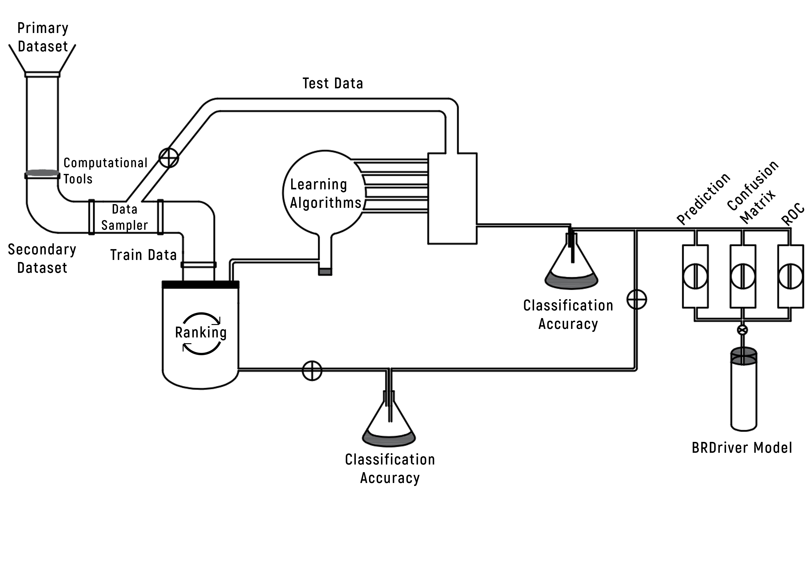

# BRDriver
The BRDriver is a Machine Learning Model, Predicts the Breast Cancer Driver Genes. The model was built using the Random Forest machine learning algorithm and seven different gene prediction tools.

It based on
- Mutpanning
- ALoFT
- CHASMplus
- P(HI)
- P(rec)
- GHIS
- LoFtool

# SetUp
If you havent got following packages you need to install them.
- PySimpleGUI
- requests
- pandas
- Orange
- pickle

# How it Works

# How Model was built

